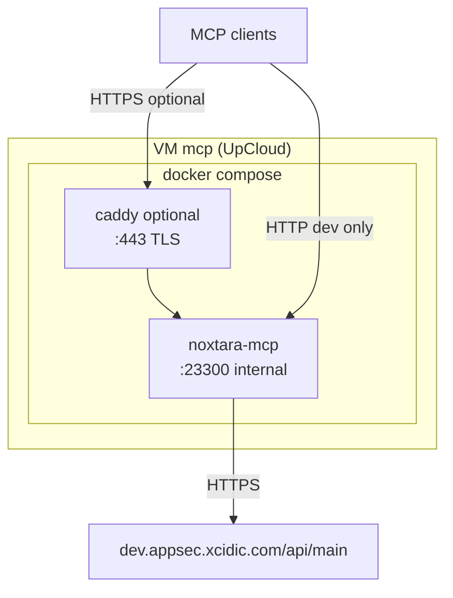

# Deployment plan (container-based)

**Status:** Deferred — not implemented yet.

This document describes the planned migration from the current bare-metal deployment on the dev MCP host to a container-based setup. It consolidates findings from the existing server (`213.163.203.233`) and design decisions discussed in planning.

## Current state (as of 2026-05-18)

| Item | Value |
|------|--------|
| Host | UpCloud VM, Ubuntu 24.04, hostname `mcp` |
| IP | `213.163.203.233` |
| Local hostname | `mcp.appsec.xcidic.com` (only in `/etc/hosts` via cloud-init) |
| Runtime | systemd unit `noxtara-mcp-dev.service` |
| User | `noxtara` (nologin) |
| App path | `/opt/noxtara-mcp/current/` (full repo copy, **no `.git`**) |
| Process | `node /opt/noxtara-mcp/current/src/cli.ts mcp-http --port 23300` |
| API backend | `NOXTARA_API_BASE_URL=https://dev.appsec.xcidic.com/api/main` |
| Node heap | `NODE_OPTIONS=--max-old-space-size=1536` (required after OOM on startup) |
| RAM | ~1.8 GiB (tight for heap + OS) |
| Exposure | HTTP on **23300** publicly (ufw); no reverse proxy, no TLS |
| Auth | PAT in URL path: `/mcp/<pat>` |
| Docker | Installed and enabled; no containers in use |
| Deploy method | Manual copy to server (not CI-driven) |

Startup loads and parses ~300 Bruno `.bru` files from `submodules/product-appsec-apidocs/main-api-collection` at process start. That drives memory use during boot.

## Goals

1. Run the MCP HTTP server in a **container** built in CI, not on the server.
2. Replace the systemd + git-tree-on-disk model with **pull image + compose up**.
3. Optionally add **HTTPS** and a stable hostname (see [Reverse proxy and TLS](#reverse-proxy-and-tls)).
4. Allow **wiping** the current deployment (`noxtara-mcp-dev.service`, `/opt/noxtara-mcp/current`) after cutover.

## Recommended stack

| Choice | Decision | Rationale |
|--------|----------|-----------|
| Container engine | **Docker** | Already on the VM; Compose tooling is standard. |
| Orchestration on host | **Docker Compose** | One file for MCP + optional proxy, env files, restart policy, memory limits. |
| Image registry | **GHCR** (TBD) | Build in CI; server only pulls. |
| Reverse proxy | **Caddy** (optional) | Simple TLS + port 443; not required for Docker itself. |
| Kubernetes / Swarm | **No** | Single-service VM; unnecessary complexity. |

Podman is a reasonable alternative org-wide, but offers no benefit on this host where Docker is already installed.

## Target architecture



### Minimal path (dev, no proxy)

- Publish container port **23300** to the host (same as today).
- Clients: `http://213.163.203.233:23300/mcp/<pat>`
- No DNS or Caddy required.
- **Downside:** PAT and traffic are unencrypted on the wire.

### Recommended path (public dev host)

- MCP listens only on the **Compose internal network** (not published publicly).
- **Caddy** (or nginx / Traefik / Cloudflare) terminates TLS on **443**.
- Clients: `https://mcp.appsec.xcidic.com/mcp/<pat>`
- ufw: allow **80** (ACME) and **443**; **do not** expose 23300 publicly.

## Reverse proxy and TLS

### Do we need Caddy?

**No — not for containers.** Caddy is optional infrastructure for:

| Problem | Without proxy | With Caddy (or similar) |
|---------|---------------|-------------------------|
| Encryption | HTTP only; PAT in URL is visible on the network | TLS on 443 |
| Client URL | `http://IP:23300/...` | `https://hostname/...` |
| Certificates | Manual or none | Automatic Let's Encrypt when DNS is correct |
| Attack surface | App port on the internet | Only 443 public; app port internal |

The application does not implement TLS today. For a host reachable from the public internet with PAT-in-URL auth, **some TLS termination is strongly recommended**.

Alternatives to Caddy on the same VM:

- **Cloudflare** (or CDN) in front — TLS at the edge; lock down origin.
- **UpCloud load balancer** with TLS.
- **TLS in Node** — would require new code; not planned in MVP.
- **VPN / SSH tunnel only** — skip public DNS and public HTTPS if access is internal.

## DNS configuration

### What exists today

On the server, cloud-init sets a **local** hosts entry:

```text
127.0.1.1  mcp.appsec.xcidic.com  mcp
```

That name works **only on the VM**. It does not help laptops, MCP clients, or Let's Encrypt. Public lookup for `mcp.appsec.xcidic.com` was **NXDOMAIN** at planning time.

### What to add (when using a hostname + HTTPS)

In the DNS provider for the `appsec.xcidic.com` zone (or parent zone), create:

| Type | Name | Value | Notes |
|------|------|--------|--------|
| **A** | `mcp` | `213.163.203.233` | If zone is `appsec.xcidic.com` → FQDN `mcp.appsec.xcidic.com` |

Adjust the record name if the managed zone is `xcidic.com` (e.g. name `mcp.appsec`).

After propagation:

```text
mcp.appsec.xcidic.com  →  213.163.203.233
```

### Why DNS matters

| Use case | Needs public DNS? |
|----------|-------------------|
| Docker / Compose internal service names (`mcp`, `caddy`) | No |
| Clients connecting by IP `:23300` | No |
| Clients using `https://mcp.appsec.xcidic.com` | **Yes** |
| Let's Encrypt HTTP-01 (Caddy default) | **Yes** — CA must resolve the name to this server |

DNS is **not** required for the container migration itself; it is required for a **stable hostname** and **automated HTTPS** on that hostname.

## Container image requirements

### Build (CI)

Multi-stage `Dockerfile`:

1. **Builder:** Node 24, pnpm, `git submodule update --init --recursive`, `pnpm install --frozen-lockfile`, `pnpm run build`.
2. **Runner:** Copy `dist/`, production `node_modules`, and **runtime submodule trees**.

CI checkout must enable submodules:

```yaml
- uses: actions/checkout@v6
  with:
    submodules: recursive
```

### Runtime command

```text
node --max-old-space-size=1536 dist/cli.mjs mcp-http --port 23300
```

Use a built artifact (`dist/cli.mjs`), not `src/cli.ts` on the server.

### What must be in the image

`bruno-parse.ts` reads the collection from disk at startup:

```text
submodules/product-appsec-apidocs/main-api-collection
```

The image must also include `submodules/bruno` (local `file:` dependency for `@usebruno/lang`). A dist-only image without these paths will fail at runtime.

### Environment variables

| Variable | Required | Notes |
|----------|----------|--------|
| `NOXTARA_API_BASE_URL` | Yes | e.g. `https://dev.appsec.xcidic.com/api/main` |
| `NODE_OPTIONS` | Recommended | `--max-old-space-size=1536` on ~2 GiB VMs |
| `NOXTARA_PAT` | No (HTTP mode) | PAT comes from client URL `/mcp/<pat>` |

Provide secrets via Compose `env_file` on the server (not baked into the image).

### Resources

- Set Compose `mem_limit` (~1800m on a 2 GiB VM).
- Prefer **4 GiB RAM** on the VM for heap + OS + Caddy headroom.
- Add a healthcheck (e.g. expect 404 on `/` or a dedicated health route).

## Repository artifacts (to implement later)

| Path | Purpose |
|------|---------|
| `Dockerfile` | Multi-stage build with submodules |
| `.dockerignore` | Exclude `.git`, tests, `.references/`, etc. |
| `deploy/compose.yml` | MCP service + optional Caddy |
| `deploy/Caddyfile` | TLS + reverse proxy to `mcp:23300` |
| `deploy/.env.example` | Document server-side env vars |
| `.github/workflows/` (extend) | Build, push image on tag or `main` |

Server deploy directory (on VM, not necessarily in git): e.g. `/opt/noxtara-mcp/deploy/` with `compose.yml`, `Caddyfile`, and `.env`.

## CI/CD model

| Where | Responsibility |
|-------|----------------|
| **CI** | Submodule init, install, build, `docker build`, push to registry (pin tags, avoid `latest` in prod) |
| **Server** | `docker compose pull && docker compose up -d` only |

No `pnpm install` or git checkout on the server after migration.

## Example Compose sketch (not final)

```yaml
services:
  mcp:
    image: ghcr.io/<org>/noxtara-mcp:<tag>
    restart: unless-stopped
    env_file: .env
    environment:
      NODE_OPTIONS: --max-old-space-size=1536
      NOXTARA_API_BASE_URL: https://dev.appsec.xcidic.com/api/main
    expose:
      - "23300"
    mem_limit: 1800m

  caddy:
    image: caddy:2-alpine
    restart: unless-stopped
    ports:
      - "443:443"
      - "80:80"
    volumes:
      - ./Caddyfile:/etc/caddy/Caddyfile
      - caddy_data:/data
    depends_on:
      - mcp
```

Omit the `caddy` service for the minimal HTTP-only path; publish `23300:23300` on `mcp` instead.

## Migration and wipe (after cutover)

1. Implement and merge container artifacts; CI publishes first image.
2. Smoke-test locally: `docker compose up`.
3. On VM: create `/opt/noxtara-mcp/deploy/`, add `compose.yml`, optional `Caddyfile`, `.env`.
4. Configure DNS (if using hostname + HTTPS).
5. Start stack; verify MCP against dev API.
6. Stop and disable `noxtara-mcp-dev.service`; remove unit file.
7. Remove `/opt/noxtara-mcp/current` (legacy tree).
8. Update ufw: allow 80/443 if using Caddy; remove public 23300.
9. Optionally remove `noxtara` system user if unused.

## Open decisions (deferred)

- [ ] Image registry and image name (`ghcr.io/...`)
- [ ] Deploy trigger: manual pull on tag vs automated SSH deploy from CI
- [ ] Hostname: `mcp.appsec.xcidic.com` vs IP-only for now
- [ ] VM resize to 4 GiB before cutover
- [ ] Include Caddy in v1 or ship HTTP-only first
- [ ] Separate dev/prod hosts or Compose profiles

## Related docs

- [PLAN.md](../PLAN.md) — product and MCP architecture
- [AGENTS.md](../AGENTS.md) — local dev conventions (pnpm, submodules)
