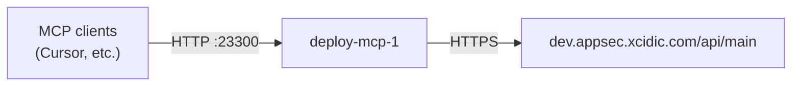

# Deployment guide

How to run and deploy the Noxtara MCP HTTP server on the dev host. Production today is **Docker Compose on a single VM**, deployed manually over SSH (no CI pipeline yet).

## Production overview

| Item | Value |
| --- | --- |
| Host | UpCloud VM, Ubuntu 24.04, hostname `mcp` |
| IP | `213.163.203.233` |
| SSH | `root@213.163.203.233` (key-based) |
| Deploy directory | `/opt/noxtara-mcp/deploy/` |
| Orchestration | Docker Compose (`compose.yml` in deploy dir) |
| Container | `deploy-mcp-1` (image `deploy-mcp`) |
| MCP URL | `http://213.163.203.233:23300/mcp/<pat>` |
| Health | `http://213.163.203.233:23300/health` |
| API backend | `https://dev.appsec.xcidic.com/api/main` |
| Auth | PAT in URL path (`/mcp/<pat>`), not in env |

The legacy **systemd** unit `noxtara-mcp-dev.service` and tree `/opt/noxtara-mcp/current/` are retired. Do not use them for new deploys.



## Prerequisites

**On your machine**

- SSH access to `root@213.163.203.233`
- This repo cloned with submodules when regenerating OpenAPI (see below)
- `pnpm` for local checks (`pnpm run check`)

**On the server** (already configured)

- Docker and Docker Compose
- Deploy tree at `/opt/noxtara-mcp/deploy/` (copy of repo artifacts needed for build)
- `.env` in the deploy directory (see [Environment](#environment))

## What gets deployed

The container image is built from the repo root `Dockerfile`:

1. **Build stage:** install deps, run `tsdown` → `dist/`
2. **Runner stage:** production deps, `dist/`, and **`specs/main-api.openapi.json`**

Runtime does **not** read Bruno `.bru` files or git submodules. The committed OpenAPI spec is the source of truth in production.

Submodules are only needed **on your laptop** when running `pnpm run generate:openapi` (Bruno collection → spec). The Docker build stubs `@usebruno/lang` so it never clones submodules on the server.

## Before you deploy

### 1. Regenerate OpenAPI (when API surface changed)

If Bruno or apidocs changed, refresh the spec locally and commit it:

```bash
./scripts/submodules.sh   # if submodules are missing
pnpm run generate:openapi
pnpm run check
git add specs/main-api.openapi.json scripts/
```

`generate:openapi` applies `limitToolName()` so `operationId` values stay ≤ 64 characters (required by Cursor’s MCP client). The registry applies the same limit at runtime as a safety net.

### 2. Smoke-test locally (optional)

```bash
cp .env.example .env
docker compose up --build
curl -s http://127.0.0.1:23300/health
# MCP: http://127.0.0.1:23300/mcp/<your-pat>
```

Default local port in `pnpm run mcp-http` is **3434**; Compose uses **23300** to match production.

## Deploy to dev (SSH + rsync)

From the **repository root** on your machine:

```bash
HOST=root@213.163.203.233
REMOTE_DIR=/opt/noxtara-mcp/deploy

rsync -avz \
  --exclude .git \
  --exclude .references \
  --exclude submodules \
  --exclude node_modules \
  --exclude dist \
  --exclude .cursor \
  --exclude .zed \
  ./ "${HOST}:${REMOTE_DIR}/"

ssh "${HOST}" "cd ${REMOTE_DIR} && docker compose build && docker compose up -d"
```

This syncs source, spec, Dockerfile, and Compose file, rebuilds the image on the VM, and recreates the container if the image changed.

### First-time server setup

If `/opt/noxtara-mcp/deploy/` does not exist yet:

```bash
ssh root@213.163.203.233 "mkdir -p /opt/noxtara-mcp/deploy"
# run rsync + compose commands above
ssh root@213.163.203.233 "cd /opt/noxtara-mcp/deploy && cp .env.example .env && \$EDITOR .env"
```

Ensure `.env` exists on the server before `docker compose up`. It is not copied from your laptop (and should not contain secrets in git).

## Environment

Server file: `/opt/noxtara-mcp/deploy/.env`

| Variable | Required | Example | Notes |
| --- | --- | --- | --- |
| `NOXTARA_API_BASE_URL` | Yes | `https://dev.appsec.xcidic.com/api/main` | Backend for tool invocations |
| `NODE_OPTIONS` | No | `--max-old-space-size=1536` | Set in `compose.yml` for the 2 GiB VM |
| `NOXTARA_PAT` | No | — | HTTP mode: clients pass PAT in `/mcp/<pat>` |

Template in the repo: [`.env.example`](../.env.example).

## Verify after deploy

```bash
ssh root@213.163.203.233 "cd /opt/noxtara-mcp/deploy && docker compose ps"
curl -s http://213.163.203.233:23300/health
```

Expect `{"status":"ok"}` and container status **healthy** (healthcheck hits `/health` every 30s).

Check tool names inside the running container (all should be ≤ 64 chars):

```bash
ssh root@213.163.203.233 "docker exec deploy-mcp-1 node -e \"
const { createOpenApiRegistry } = await import('./dist/runtime/openapi/registry.mjs');
const r = createOpenApiRegistry({ forceReload: true });
const long = r.tools.filter(t => t.name.length > 64);
console.log('tools', r.tools.length, 'over 64 chars', long.length);
\""
```

**Clients:** reconnect MCP in Cursor (or restart the MCP session) so the tool list refreshes.

## Operations

| Task | Command (on server, in deploy dir) |
| --- | --- |
| Logs | `docker compose logs -f mcp` (includes `[UPSTREAM]` lines for API calls) |
| Restart | `docker compose restart mcp` |
| Stop | `docker compose down` |
| Rebuild only | `docker compose build` |
| Shell in container | `docker exec -it deploy-mcp-1 sh` |

Compose sets `mem_limit: 1800m` and `restart: unless-stopped`. The VM has ~2 GiB RAM; avoid running heavy workloads alongside MCP without resizing the VM.

## Troubleshooting

| Symptom | Likely cause | What to do |
| --- | --- | --- |
| Cursor: tool name max 64 chars | Old spec or old image | Redeploy; confirm `specs/main-api.openapi.json` has no `operationId` longer than 64 chars |
| Container exits / OOM | Heap + low RAM | Confirm `NODE_OPTIONS` in compose; consider 4 GiB VM |
| `Unknown tool` after deploy | Client cache or renamed tools | Reconnect MCP; tool names may change when long `operationId`s are truncated |
| Health check failing | Server still starting or crash loop | `docker compose logs mcp`; wait ~30s for first healthy |
| API errors on invoke | Wrong `NOXTARA_API_BASE_URL` or invalid PAT | Check `.env` and client URL path |

## Security notes

- MCP is **HTTP only** on a public IP; the PAT appears in the URL. Treat the PAT as a secret and prefer TLS when exposing this beyond trusted dev use.
- Do not commit `.env` or PATs. Rotate PATs if a URL was leaked.
- ufw allows **23300** publicly today. A future improvement is TLS on 443 (Caddy or CDN) and not publishing 23300.

## Repository layout (deploy-related)

| Path | Purpose |
| --- | --- |
| `Dockerfile` | Multi-stage image build |
| `compose.yml` | Production Compose service definition |
| `.dockerignore` | Keeps image context small (no submodules, docs, tests) |
| `specs/main-api.openapi.json` | Runtime tool definitions (commit when APIs change) |
| `scripts/generate-openapi.ts` | Regenerate spec from Bruno submodule |
| `src/runtime/openapi/tool-name.ts` | 64-char tool name limit (Cursor / MCP clients) |
| `.env.example` | Document server env vars |

## Future improvements (not implemented)

- **CI + GHCR:** build image in GitHub Actions; server runs `docker compose pull && up -d` only
- **TLS:** Caddy (or similar) on 443, DNS `mcp.appsec.xcidic.com` → `213.163.203.233`
- **Deploy script:** wrap rsync + remote compose in `scripts/deploy.sh`
- **Separate dev/prod hosts** or Compose profiles

## Related docs

- [PLAN.md](../PLAN.md) — product and MCP architecture
- [AGENTS.md](../AGENTS.md) — local dev (pnpm, submodules)
- [openapi-migration-handoff.md](./openapi-migration-handoff.md) — OpenAPI migration notes
